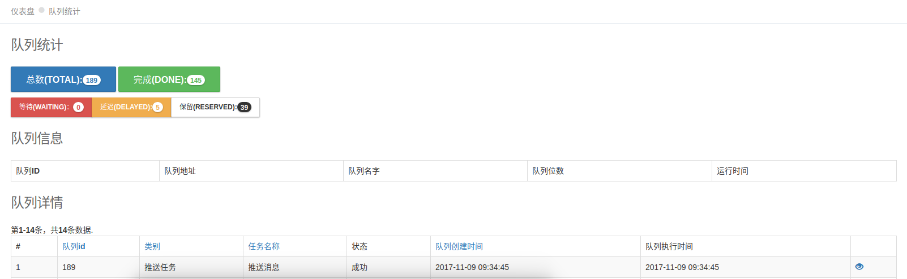

# yii2 queue-backend module
[](https://packagist.org/packages/graychen/yii2-queue-backend)
[](https://packagist.org/packages/graychen/yii2-queue-backend)
[](https://travis-ci.org/Graychen/yii2-queue-backend)
[](https://scrutinizer-ci.com/g/Graychen/yii2-queue-backend/?branch=master)
[](https://scrutinizer-ci.com/g/Graychen/yii2-queue-backend/?branch=master)
[](https://scrutinizer-ci.com/g/Graychen/yii2-queue-backend/build-status/master)
[](https://styleci.io/repos/109097207)

This is a background for yii-queue, there are queue statistics, temporary support redis driver
# Migrate database

## To add a lookup table to your database, following is the sql for lookup:

``` mysql
CREATE TABLE IF NOT EXISTS `tb_queue` (
  `id` int(11) NOT NULL AUTO_INCREMENT,
  `queue_id` int(11) DEFAULT NULL,
  `catalog` varchar(50) DEFAULT NULL,
  `name` varchar(50) DEFAULT '1',
  `description` text,
  `log` text,
  `exec_time` int(11) DEFAULT '1',
  `status` smallint(6) DEFAULT '1',
  `created_at` int(11) DEFAULT NULL,
  `updated_at` int(11) DEFAULT NULL,	  
  PRIMARY KEY (`id`),  
) ENGINE=InnoDB  DEFAULT CHARSET=UTF8 AUTO_INCREMENT=1 ;
```
## Or else you can use yii migration
```
yii migrate/up --migrationPath=@graychen/yii2/queue/backend/migrations
```
## Usage
### Config -> main.php 
```
'controllerMap' => [
        'migrate' => [
            'class' => 'yii\console\controllers\MigrateController',
            'migrationPath' => [
                '@graychen/yii2/queue/backend/migrations'
            ],
        ],
    ],
```
### Config Module in components part
``` php 
'queue' => [
            'class' => 'graychen\yii2\queue\backend\Module',
]
```
## View
### after that,you can website `https://localhost/admin/queue/default`



## ChangeLog
[changelog](https://github.com/Graychen/yii2-queue-backend/blob/master/CHANGELOG.md)

